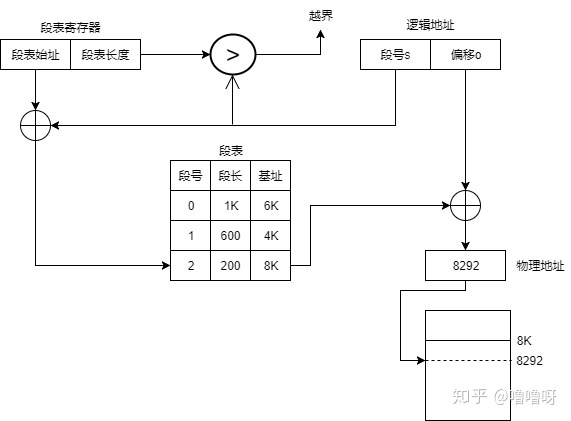
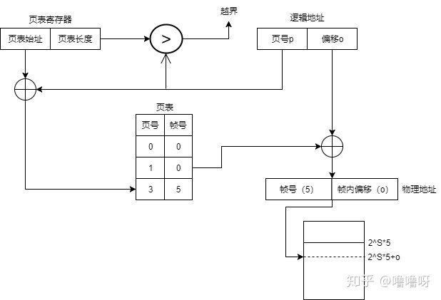
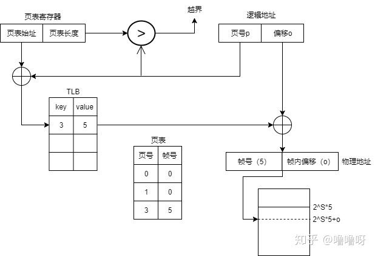
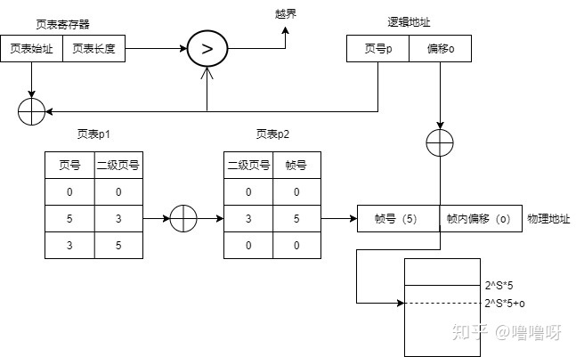
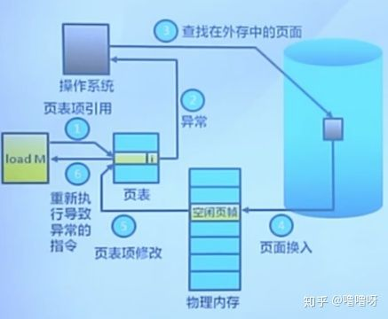

# 复盘
## 操作系统
#### OS设计总结
- 以多进程形式，允许多个任务同时进行
- 以多线程形式，允许单个任务分成不同的部分运行
- 提供协调机制，一方面防止进程之间产生冲突，另一方面允许进程和线程之间共享资源

### [进程管理](https://zhuanlan.zhihu.com/p/88017448)
#### 进程 vs 程序
- 程序是产生进程的基础
- 每次运行程序将构成不同的进程
- 进程是动态的，程序是静态的；进程是暂时的，程序是永久的
- **进程**=**程序**+数据+PCB进程控制块

#### [进程 vs 线程](http://www.ruanyifeng.com/blog/2013/04/processes_and_threads.html)
##### 进程
- 是正在运行的程序的实例，是程序的一次执行
- 进程是**资源分配**的基本单位
- 用PCB（进程控制块/进程表）和状态队列实现
- 进程之间要进行**同步**和**互斥**
- **引入进程是为了让程序能够并发执行**
##### 线程
- 线程是**CPU调度**的基本单位
- 用TCB实现
- 包含在进程里，一个进程可以同时存在多个线程
- 线程之间可以**并发**执行
- 线程之间可以共享地址空间和文件等资源，因此，进程内的线程之间要进行**同步**和**互斥**

#### 进程的三种状态 & 转换
##### 三种状态
1. ready 就绪状态
    进程已经被分配到**除CPU以外**的所有必要资源，只要获得处理机CPU就可以执行
2. running 执行状态
    - 进程已经获得处理机CPU，正在CPU上执行
    - 处于执行状态的进程数小于等于CPU数
3. blocked 阻塞状态
    正在running执行的进程，由于**等待某个事件**发生，而无法继续执行，便放弃CPU，处于阻塞状态。如：等待I/O完成，等待信号，申请缓冲区不能满足等。
##### 阻塞 vs 挂起
- **挂起**：把一个进程从内存转到外存，没有让出cpu
    - **阻塞挂起**：进程在外存，等待某事件发生
    - **就绪挂起**：进程在外存，等待进入内存运行
- **阻塞**：让出cpu
##### 状态转换
1. ready -> running
    **就绪**状态的进程，获得了CPU，转换成**执行**状态
2. running -> ready
    **执行**状态的进程，因为**用完分配的时间片**，不得不让出CPU，转换成**就绪**状态
3. running -> blocked
    **执行**状态的进程，因为等待某个事件发生，无法继续执行，转换成**阻塞**状态
4. blocked -> ready
    **阻塞**状态的进程，如果等待的事件已经发生，就又可以转换成**就绪**状态，再次等待获得CPU，重新进入**执行**状态

#### 进程调度
有不可抢占调度和可以抢占调度

#### 进程间通信
待补充

#### 线程同步的方式
- 车间内的工人共享车间的空间，即每个线程共享同一进程里的内存。
- 某些内存区域，只能提供给固定数量的线程使用。
##### 互斥锁（互斥）
- 只允许一个线程同一时刻访问同一资源
- 用来防止多个线程同时读写某一块内存区域
- 车间里的某些房间只容纳一个工人，会在门口上一把锁，先到的人锁上门，其他人排队，直到锁打开
##### 信号量（同步）
- 允许多个线程同一时刻访问同一资源，但需要控制最大线程量
- 用来保证多个线程之间不会互相冲突
- 车间里的某些房间只容纳n个工人，会在门口放上n把钥匙，先到的人就取一把钥匙开门进去，出来再把钥匙挂回原处，钥匙架空的时候其他人必须排队
##### 管程（同步）
待补充

### 死锁
#### 产生死锁四个必要条件
- 互斥条件：一段时间内某一资源仅为一个进程所占用
- 请求和保持条件：当进程因请求资源而阻塞时，**对已获得的资源保持不放**
- 不可剥夺条件：进程已获得的资源在**未使用完之前不可剥夺**，只能在使用完后自己释放
- 循环等待条件：在发生死锁时，必然存在一个进程-资源的环形链
#### 处理死锁问题
1. 鸵鸟
不做任何处理，重启。
2. 允许死锁产生，检测并恢复死锁
- 检测死锁
- 恢复死锁
    - 抢占恢复：抢占别的进程的资源
    - 回滚恢复：在内存中记录进程的状态，将进程恢复到上一个安全状态
    - 杀死进程
3. 不允许死锁产生，避免死锁
- 破坏互斥条件：一次性分配所有资源。
- 破坏请求和保持条件：只要有一个资源没得到分配，就不给这个进程分配其他资源。可以在一开始就请求所有的资源。
- 破坏不可剥夺条件：当进程已获得部分资源，但得不到其他资源，则释放已占有的资源。释放占有的资源，给其他进程使用。
- 破坏环路等待条件：系统给每一类资源编号，每个进程按编号递增的顺序请求资源，释放则相反。即按顺序使用资源。

### [内存管理](https://zhuanlan.zhihu.com/p/87514615)
#### 连续内存分配
- 首次适配算法
找到**第一个**合适的空闲块
- 最佳适配算法
找到合适的空闲块中**最小**的一块
- 最差适配算法
找到合适的空闲块中**最大**的一块
#### 非连续内存分配
因为连续内存分配容易产生碎片，导致内存利用率低，而非连续内存分配可以很好地解决碎片问题
##### 分段法
1. 先判断**逻辑地址**中的**段号**，是否超过**段表寄存器**中的**段表长度**，超过就会越界异常
2. 通过段号在**段表**中找到对应的一行
3. 判断**逻辑地址**中的**偏移**，是否超过段表这一行的**段长**，超过就越界异常
4. 通过段表这一行的**基址**和偏移，得到**物理地址**，就是要访问的**主存地址**

##### 分页法
绝大多数CPU采用分页机制，机制与分段类似。需要将物理内存划分为固定大小的帧，将逻辑地址空间划分为相同大小的页。
- 普通页表

- 页表缓存：如果TLB（转换检测缓冲区）命中，直接找到帧号；否则对应的页表项会被更新到TLB中

- 多级页表

##### 分段 vs 分页
    - 分页仅仅是为了系统管理的需要
    - 分段是为了能更好的满足用户的需要

#### 虚拟内存 √
- 用来解决当前内存不够进程分配的问题
- 把程序中的一部分放入到内存中，根据内存的使用情况，动态的对程序的部分内容在**内存**和**外存**之间进行交换
- 通过把**物理内存与外存结合**，提供给用户的虚拟内存空间大于实际内存空间
##### 虚拟内存 vs 物理内存
- 物理内存是实际存在的
- 虚拟内存是通过内存和外存结合来实现，不是实际的内存
##### 用虚拟页式内存管理实现虚拟内存
1. 当一个程序需要调入内存运行时，不需要将这个程序的所有页面都装入内存，只要装入部分页面就可以启动程序
2. 在运行的过程中，如果发现需要访问的数据不在内存中，则向系统发出**缺页中断**请求
3. 系统处理缺页中断请求时，**将外存中相应的页面置换内存中的空闲页面**，使得程序继续运行

##### 页面置换算法
- 局部页面置换算法
    - 最优页面置换算法：置换掉最长时间没有使用的页面
    - 先进先出算法：置换掉在内存中驻留时间最长的页面，即最先进入内存的页面
    - 最近最久未使用算法：近似最优页面置换算法
    - 时钟置换算法
    - 二次机会算法：对时钟置换算法的改进
    - 最不常用算法：置换掉最少用的页面
- 全局页面置换算法